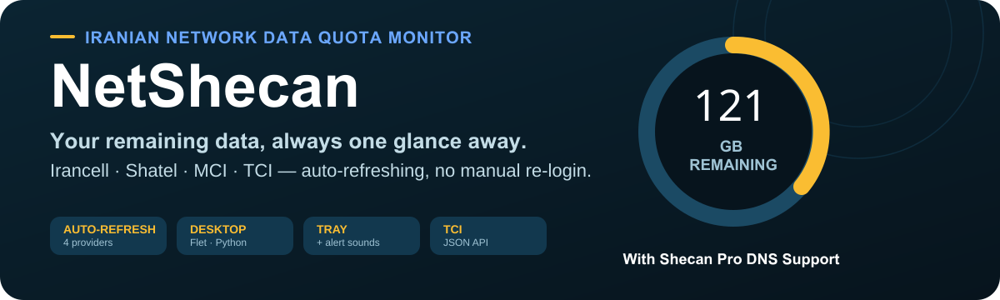

<p align="center">
  
</p>

<p align="center">
  <strong>Remaining · used · total</strong> data for <strong>Irancell</strong>, <strong>Shatel</strong> and <strong>MCI</strong> in one small desktop app — that <strong>keeps itself logged in</strong>.
</p>

---

## Why NetShecan

Mobile and fixed-line data plans hide your quota behind login walls and short-lived tokens. NetShecan is a tray-friendly Windows app that shows the numbers that matter and **renews the provider tokens automatically**, so you never have to re-paste credentials every few hours.

- **Live dashboard** — a big remaining-data ring plus USED / TOTAL cards and the expiry date.
- **Multiple providers** — Irancell, Shatel (MyShatel) and MCI (Hamrah-e-Aval), switchable from the main screen.
- **Automatic refresh** — stores a long-lived refresh token and exchanges it for a fresh access token before it expires.
- **Other packages** — gift / extra data packages shown separately with their own remaining values.
- **Low-data alert** — plays a sound and brings the window forward below your threshold.
- **Tray support** — minimize to the system tray; optional Shecan DNS status check.

---

## How it stays logged in

<p align="center">
  
</p>

Each provider exposes a short-lived *access token* and a longer-lived *refresh token*. NetShecan keeps the refresh token in `config.json` and, on every check, renews the access token before it expires:

| Provider | Access token | Refresh token | Auto-refresh lasts |
|---|---|---|---|
| Irancell | 20 h | ~10 years | effectively forever |
| Shatel | 1 h | rotated each use | effectively forever |
| MCI | 30 min | ~30 days | ~30 days |

Only MCI eventually needs a re-login (about once a month) — and the bundled Chrome extension makes re-seeding a single click.

---

## Quick start

### Requirements

- **Python 3.10+**
- `pip install flet`  (add `pystray pillow` for tray support)

### Run

```bash
python netshecan.py
```

On first run a `config.json` is created next to the app. Copy `config.example.json` to `config.json` and fill in your tokens (see below).

### Tests

```bash
python test_netshecan.py
```

---

## Getting your tokens

Because refresh tokens rotate, the easiest way to seed them is the bundled **Chrome extension**.

### Install the extension (load unpacked)

1. Open `chrome://extensions` and enable **Developer mode**.
2. Click **Load unpacked** and select the `netshecan-chrome-extension/` folder.

### Copy tokens for a provider

1. Log in to the provider in Chrome:
   - Irancell → `https://my.irancell.ir`
   - Shatel → `https://beta.my.shatel.ir`
   - MCI → `https://my.mci.ir`
2. Click the **NetShecan Helper** toolbar icon → **Copy JSON**.
3. In NetShecan, open **Settings** → **Paste from Extension**.

NetShecan reads the clipboard, shows a confirmation of what will be imported, and on **Apply** writes the tokens into `config.json`, switches to the matching provider, and refreshes the inputs. Your aggregation preference and other settings are preserved.

### Manual seeding

Paste tokens into **Settings** (or edit `config.json`). See [`NetShecan-AuthFlow.md`](./NetShecan-AuthFlow.md) for the exact endpoints and where each provider keeps its tokens in the browser's `localStorage`.

> ⚠️ Never commit your real `config.json` — it contains long-lived refresh tokens. Use `config.example.json` as a template.

---

## Configuration

```jsonc
{
  "provider": "irancell",            // active provider: irancell | shatel | mci
  "providers": { /* per-provider tokens + client constants */ },
  "poll_seconds": 300,               // auto check interval (seconds)
  "usage_threshold_mb": 300,         // low-data alert threshold (MB)
  "check_shecan": true,              // run the Shecan DNS check
  "shecan_url": "",
  "minimize_to_tray": false
}
```

### Include Additional Data Packages

A per-provider setting that controls what the headline remaining number counts:

- **Irancell / MCI** (default **OFF**): the main (non-gift) package only.
- **Shatel** (default **ON**): the base plan plus all additional traffic packages.

Individual packages always appear under **OTHER PACKAGES**, regardless of this setting.

---

## Auth flows

Full, up-to-date authentication and token-refresh documentation for all three providers lives in **[`NetShecan-AuthFlow.md`](./NetShecan-AuthFlow.md)** — including the OTP login steps, refresh requests, data endpoints, and token storage keys.

---

## Building a portable executable

A PyInstaller spec is included.

```bash
pip install pyinstaller flet pystray pillow
pyinstaller NetShecan.spec --noconfirm --clean
```

Output: `dist/NetShecan.exe`. Keep `dist/config.json` next to it — that is where the app reads and writes your settings. The spec does **not** embed `config.json`, so your tokens are never baked into the executable.

---

## Project layout

```
netshecan.py                      # main app (Flet UI + providers)
test_netshecan.py                 # unit tests
NetShecan.spec                    # PyInstaller build config
version_info.txt                  # Windows version metadata
config.example.json               # template config (no real tokens)
NetShecan-AuthFlow.md             # provider auth documentation
netshecan-chrome-extension/       # NetShecan Helper Chrome extension
assets/
  readme/                         # this README's visuals (hero, workflow)
  icons/                          # app icon (netshecan-icon.ico/.png)
  providers/                      # per-provider icons used in the UI
  audio/                          # alert sounds (low-usage, shecan)
```

---

## Disclaimer

This project is for personal use and reading one's own account data. It relies on undocumented public web APIs that may change without notice. Use at your own risk, and never share your `config.json`.

---

## License

GPL-3.0-or-later (GNU General Public License, version 3 or any later version).
See [LICENSE](./LICENSE) for the full license text.

You are free to use, study, modify and redistribute this software, provided
that derivative works are also released under the GPL. This is **not** legal
advice — read the full license before distributing.
